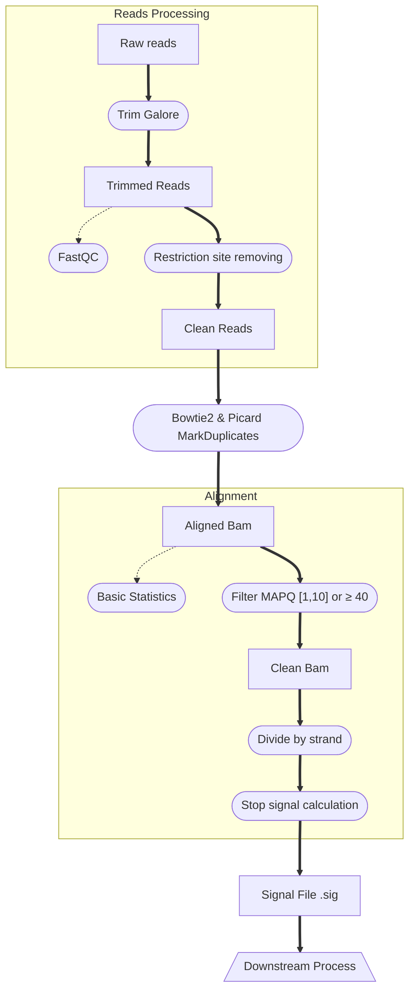
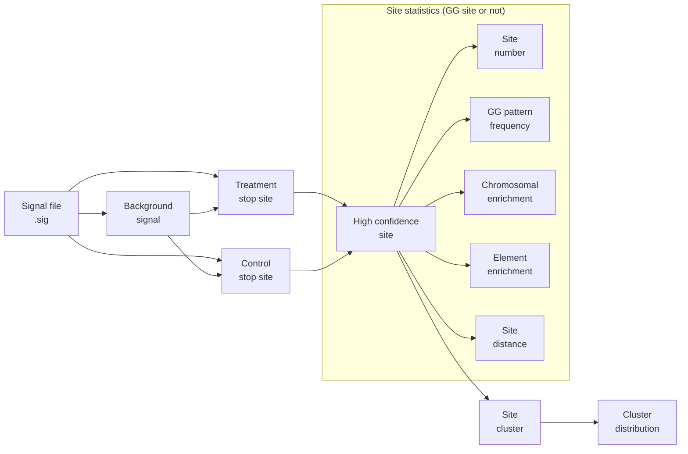

# Pt-seq analysis pipeline

Pt seq is a high-throughput library construction method specifically designed to detect high-sensitivity single base resolution Pt drag binding sites on the genome in various Pt drag treated biological samples.

If you have any questions, feel free to propose an issue or contact Li Mingyang (limingyang200101@gmail.com or limingyang@stu.pku.edu.cn).


## Main

This repository contains 2 snakemake pipelines, for basic alignment pipeine and site calling, process pipeline separately. Detailed descriptions about this repository could be found at the paper.

**The basic alignment pipeline:**



**The downstream analysis pipeline:**



## Section 1. Basic Preperation

1. Clone the repository

Clone this repository into your service and `cd` into the directory.

After clonning, your directory structure is like this:
```
.
├── 0.process_platin_q0_unique.snake.py
├── 1.from_q0_to_q1to10_and_40.snake.py
├── 2.downstream_pipeline
│   ├── main_downs.py
│   └── snk_script
│	   ├── ...
├── cal_covered_genome.py
├── filter_reads_withSbfI.py
├── README.md
└── tools
	└── 0.all_signal.py
```

---

2. Prepare the raw data

Inside the repository direction, create a directory called `data`, and put your Pt-seq `.fastq.gz` into the `data/{project_name}/` directory. In this example, we name the project `example_data`. After that, record the name of samples into `sample_id/{project_name}.txt` file.

Directory structure:

```
.
├── 0.process_platin_q0_unique.snake.py
├── 1.from_q0_to_q1to10_and_40.snake.py
├── 2.downstream_pipeline
│   ├── main_downs.py
│   └── snk_script
│	   ├── ...
├── cal_covered_genome.py
├── data // --🔴 NEW--
│   └── example_data
│	   ├── sample1_1.fq.gz
│	   ├── sample1_2.fq.gz
│	   ├── sample2_1.fq.gz
│	   └── sample2_2.fq.gz
├── sample_id // --🔴 NEW-- 
│   └── example_data.txt
├── ...
```

Where `example_data.txt`:
```
sample1
sample2
```

**NOTE: The sample name should not contain character underline "\_" !!**

---

3. Set the reference genome

Edit the main pipeline file `0.process_platin_q0_unique.snake.py`

You only need to modify these variables based on your needs:
- `genome_dir`: The directory (absolute address recommended) where the reference genome `fasta` file and the relavent bowtie2 index locate.
- `genome_fasta_file`: Reference genome `fasta` file basename.
- `genome_index_basename`: Prefix of bowtie2 index.
- `datasets`: This is a list, you need to add your project name inside. In this example, we modify the datasets to `datasets = ['example_data']`

If you have other more customized needs, just modify this file for free.

---

4. Conduct basic alignment

To finish this step, you shall install relavent softwares and run the pipeline `0.process_platin_q0_unique.snake.py`

Required softwares:
- `snakemake 7.32.3`
- `trim_galore 0.6.1`
- `FastQC 0.12.1`
- `Bowtie2 2.5.4`
- `samtools 1.19.2`, with `htslib 1.20`
- `java openjdk 21.0.2-internal 2024-01-16`
- `sambamba 1.0.0`
- `python 3.12.2`
- And make sure all those softwares have been recorded into $PATH.

Required python modules:
- `Bio 1.83`
- `pysam 0.22.1`
- `pandas 2.2.2`
- `click 8.1.7`


Then, you can run this code to check your settings:
```shell
snakemake -s 0.process_platin_q0_unique.snake.py --dry-run --rerun-incomplete --rerun-triggers mtime -pr
```

If everything works fine, you can run the pipeline locally based on the shell code below:
```shell
snakemake -s 0.process_platin_q0_unique.snake.py -c 100 --rerun-incomplete --rerun-triggers mtime
```

Or submit the jobs into cluster (slurm):
```shell
mkdir -p cluster cluster_log logs
snakemake --cluster "sbatch -N 1 -c {threads} -J '{rule}.{wildcards}' -o cluster_log/{rule}.{wildcards}.out -e logs/{rule}.{wildcards}.err -p PARTITION -A ACCOUNT --no-requeue --qos QOS" \ 
	--nolock \
	-s 0.process_platin_q0_unique.snake.py \
	-j 100 \
	--latency-wait 1000 \
	--force-use-threads \
	-pr \
	--rerun-incomplete \
	--rerun-triggers mtime > cluster_log/run.log 2> cluster/run.err
```

---
---
## Section 2. Downstream Analysis

5. Prepare for downstream analysis enviornment

After running the pipeline, you could see there are new directories including alignment results.

```
.
├── 0.process_platin_q0_unique.snake.py
├── 1.from_q0_to_q1to10_and_40.snake.py
├── 2.downstream_pipeline
│   ├── main_downs.py
│   └── snk_script
│	   ├── ...
├── cal_covered_genome.py
├── data
│   └── example_data
│	   ├── sample1_1.fq.gz
│	   ├── sample1_2.fq.gz
│	   ├── sample2_1.fq.gz
│	   └── sample2_2.fq.gz
├── sample_id
│   └── example_data.txt
├── ...
├── output // --🔴 NEW--
│   └── example_data
│	   ├── trim
│	   │	└── ... // Trimmed fastq files and FastQC results.
│	   ├── align/genome
│	   │	└── ... // Basic alignment BAM files with no filtering.
│	   └── align_1_10_40/genome // 👈 IMPORTANT
│			├── sample1_genome_sorted_rmdup_fwd.bam
│			├── sample1_genome_sorted_rmdup_rvs.bam
│			├── sample2_genome_sorted_rmdup_fwd.bam
│			├── sample2_genome_sorted_rmdup_rvs.bam
│			├── sample1_fwd_sig.txt
│			├── sample1_rvs_sig.txt
│			├── sample2_fwd_sig.txt
│			└── sample2_rvs_sig.txt
├── ...
```

What we really care is the `output/{project_name}/align_1_10_40/genome/` directory.

Now, enter the directory `output/{project_name}/align_1_10_40/genome/` by
```shell
cd output/{project_name}/align_1_10_40/genome/
```

And softlink downstream analysis pipeline here.
```shell
ln -s ../../../../2.downstream_pipeline/* ./
```

Now your directory is like:

```
.
├── sample1_genome_sorted_rmdup_fwd.bam
├── sample1_genome_sorted_rmdup_rvs.bam
├── sample2_genome_sorted_rmdup_fwd.bam
├── sample2_genome_sorted_rmdup_rvs.bam
├── sample1_fwd_sig.txt
├── sample1_rvs_sig.txt
├── sample2_fwd_sig.txt
├── sample2_rvs_sig.txt
├── main_downs.py // --🔴 NEW--
├── main_downs_brief.py // --🔴 NEW--
└── snk_script // --🔴 NEW--
	└── ... // Other codes
```

Now, the enviornment for downstream analysis is donw, except for extra softwares and python modules you may need to install.

> Here, the `main_downs.py` is a snakemake pipeline which is easy-to-use but hard-to-setup. This pipeline includes all possible necessary functions like Pt-drug site calling, cluster calling, site/cluster position visualization, site pattern statistics and GG pattern extracting, site annotation analysis and so on.
> If you feel hard to setup and configure the `main_downs.py`, you can just configure the enviornment for `main_downs_brief.py`, which is easy-to-setup but only contains most basic functions including site calling and cluster calling.
> If you decide to only configure the environment related to `main_dewns_brief.by`, you can only install the ones marked with 🌟.

Required extra softwares:
- `bedtools 2.31.1` 🌟
- `deepTools 3.5.5`
- `R 4.3.3`
- `HOMER v4.11.1` with hg38 genome annotations installed
- And make sure all those softwares have been recorded into $PATH.


Required extra python modules:
- `rich` 🌟
- `rich_click 1.7.4` 🌟
- `polars 1.21.0` 🌟
- `numpy 1.26.4`
- `scipy 1.12.0` 🌟

Required R packages:
- `ggplot2 3.5.1`
- `dplyr 1.1.4`
- `readr 2.1.5`
- `tidyr 1.3.1`
- `ggsci 3.0.1`
- `patchwork 1.2.0`
- `ggprism 1.0.5`
- `argparse 2.2.2`
- `stringr 1.5.1`
- `tidyverse 2.0.0`
- `rayshader 0.24.10`
- `ggseqlogo 0.2`
- `forcats 1.0.0`
- `karyoploteR 1.28.0`
- `GenomicRanges 1.54.1`
- `rtracklayer 1.62.0`
- `ggridges 0.5.6`
- `purrr 1.0.2`

Now, edit the pipeline file `main_downs.py` or `main_downs_brief.py`, change the following variables:
- `trts`: Pt-drug treatment sample names.
- `ctrltrt`: Control sample name without Pt-drug treatment.
- `hg38`: Reference genome FASTA file address.
- `rates`: Cutoff for binding ratio, sites with ratio > the set rate will pass this filter.
- `cuts`: Cutoff for coverage, sites with stop coverage > the set cut will pass this filter.

---
6. Conduct downstream analysis.

After configuring, you can test the pipeline and run it in the same way as described in step 4.
